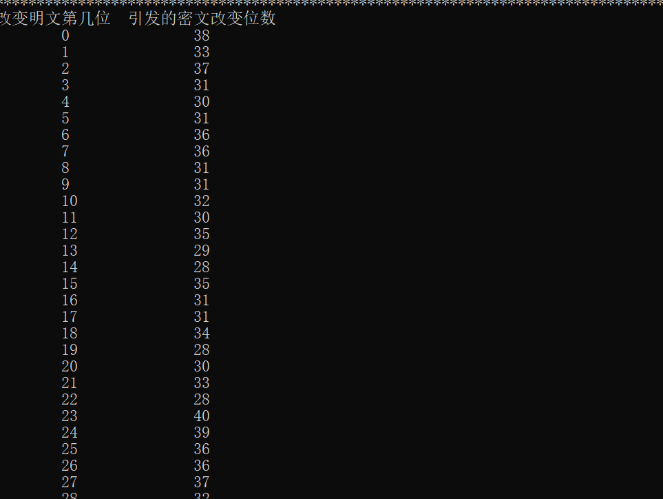

### 密码学实验报告——分组密码算法DES

#### 赵梓杰 1811463 信息安全

（实验环境 win10 dev c++）

1. 实验目的

   通过DES算法的编程实验加深对DES算法运行原理的理解，以及理解分组密码的加密算法设计和解密算法设计

2. 实验原理

   由于Xmind使用的不太顺手，可能图片较长不太清晰，已经将xmind文件和png原文件放在文件夹内

   

3. DES加密

   具体代码见程序代码文件夹或报告底部，展示效果如下：

   

   

4. DES解密

   具体代码见程序代码文件夹或报告底部，展示效果如下：

   

5. 雪崩效应——改变明文

   

   

6. 雪崩效应——改变密钥

   

   

7. 相关代码解释

   加密解密以及雪崩效应的代码都调用了个人所构造的des.h头文件

   ```c++
   #include <iostream>
   #include <string>
   using namespace std;
   
   //初始置换IP表
   const static int IP_Table[64] =
   {
       58,50,42,34,26,18,10,2,60,52,44,36,28,20,12,4,
       62,54,46,38,30,22,14,6,64,56,48,40,32,24,16,8,
       57,49,41,33,25,17,9,1,59,51,43,35,27,19,11,3,
       61,53,45,37,29,21,13,5,63,55,47,39,31,23,15,7
   };
   
   //逆初始置换IPR表
   const static int IPR_Table[64] =
   {
       40,8,48,16,56,24,64,32,39,7,47,15,55,23,63,31,
       38,6,46,14,54,22,62,30,37,5,45,13,53,21,61,29,
       36,4,44,12,52,20,60,28,35,3,43,11,51,19,59,27,
       34,2,42,10,50,18,58,26,33,1,41,9,49,17,57,25
   };
   
   //E扩展选择表
   static const int E_Table[48] =
   {
       32,1,2,3,4,5,4,5,6,7,8,9,
       8,9,10,11,12,13,12,13,14,15,16,17,
       16,17,18,19,20,21,20,21,22,23,24,25,
       24,25,26,27,28,29,28,29,30,31,32,1
   };
   
   //P换位表
   const static int P_Table[32] =
   {
       16,7,20,21,29,12,28,17,1,15,23,26,5,18,31,10,
       2,8,24,14,32,27,3,9,19,13,30,6,22,11,4,25
   };
   
   //PC1选位表(用于完成密钥置换PC-1)
   const static int PC1_Table[56] =
   {
       57,49,41,33,25,17,9,1,58,50,42,34,26,18,
       10,2,59,51,43,35,27,19,11,3,60,52,44,36,
       63,55,47,39,31,23,15,7,62,54,46,38,30,22,
       14,6,61,53,45,37,29,21,13,5,28,20,12,4
   };
   
   //PC2选位表(用于完成密钥置换PC-2)
   const static int PC2_Table[48] =
   {
       14,17,11,24,1,5,3,28,15,6,21,10,
       23,19,12,4,26,8,16,7,27,20,13,2,
       41,52,31,37,47,55,30,40,51,45,33,48,
       44,49,39,56,34,53,46,42,50,36,29,32
   };
   
   //左移位数表 
   const static int LOOP_Table[16] =
   {
       1,1,2,2,2,2,2,2,1,2,2,2,2,2,2,1
   };
   
   // S盒
   const static int S_Box[32][16] = {
                       {14,4,13,1,2,15,11,8,3,10,6,12,5,9,0,7},{0,15,7,4,14,2,13,1,10,6,12,11,9,5,3,8},
                       {4,1,14,8,13,6,2,11,15,12,9,7,3,10,5,0},{15,12,8,2,4,9,1,7,5,11,3,14,10,0,6,13},
                       {15,1,8,14,6,11,3,4,9,7,2,13,12,0,5,10},{3,13,4,7,15,2,8,14,12,0,1,10,6,9,11,5},
                       {0,14,7,11,10,4,13,1,5,8,12,6,9,3,2,15},{13,8,10,1,3,15,4,2,11,6,7,12,0,5,14,9},
                       {10,0,9,14,6,3,15,5,1,13,12,7,11,4,2,8},{13,7,0,9,3,4,6,10,2,8,5,14,12,11,15,1},
                       {13,6,4,9,8,15,3,0,11,1,2,12,5,10,14,7},{1,10,13,0,6,9,8,7,4,15,14,3,11,5,2,12},
                       {7,13,14,3,0,6,9,10,1,2,8,5,11,12,4,15},{13,8,11,5,6,15,0,3,4,7,2,12,1,10,14,9},
                       {10,6,9,0,12,11,7,13,15,1,3,14,5,2,8,4},{3,15,0,6,10,1,13,8,9,4,5,11,12,7,2,14},
                       {2,12,4,1,7,10,11,6,8,5,3,15,13,0,14,9},{14,11,2,12,4,7,13,1,5,0,15,10,3,9,8,6},
                       {4,2,1,11,10,13,7,8,15,9,12,5,6,3,0,14},{11,8,12,7,1,14,2,13,6,15,0,9,10,4,5,3},
                       {12,1,10,15,9,2,6,8,0,13,3,4,14,7,5,11},{10,15,4,2,7,12,9,5,6,1,13,14,0,11,3,8},
                       {9,14,15,5,2,8,12,3,7,0,4,10,1,13,11,6},{4,3,2,12,9,5,15,10,11,14,1,7,6,0,8,13},
                       {4,11,2,14,15,0,8,13,3,12,9,7,5,10,6,1},{13,0,11,7,4,9,1,10,14,3,5,12,2,15,8,6},
                       {1,4,11,13,12,3,7,14,10,15,6,8,0,5,9,2},{6,11,13,8,1,4,10,7,9,5,0,15,14,2,3,12},
                       {13,2,8,4,6,15,11,1,10,9,3,14,5,0,12,7},{1,15,13,8,10,3,7,4,12,5,6,11,0,14,9,2},
                       {7,11,4,1,9,12,14,2,0,6,10,13,15,3,5,8},{2,1,14,7,4,10,8,13,15,12,9,0,3,5,6,11} };
   
   //获取string输入 补零后存入char*
   char* get_text(string input){
   	string text = input.substr(0,16);
   	if(text.size() < 16){
   		int temp = text.size();
   		for(int i = 1;i <= 16 - temp ; i++){
   			text = text + '0';
   		}
   	}
   	char* char_text = new char [17];
   	text.copy(char_text,16,0);
   	char_text[16] = '\0';
   	return char_text;
   }
   
   //判断
   bool is_input_valid(char* str){
   	for(int i = 0;i<15;i++){
   		if (!((str[i] >= 'A' && str[i] <= 'F') || (str[i] >= 'a' && str[i] <= 'f') || (str[i] >= '0' && str[i] <= '9'))){
   			return 0;
   		}
   	}
   	return 1;
   }
   
   void hex_to_bin(char* hex,int* bin){
   	for(int i = 0,k = 0; i<16 ;i++){
   		int val = 0;
   		if(hex[i] >= '0' && hex[i] <= '9'){
   			val = hex[i] - '0';
   		}
   		else if (hex[i] >= 'A' && hex[i] <= 'F'){
   			val = hex[i] - 'A' + 10;
   		}
   		else if (hex[i] >= 'a' && hex[i] <= 'f'){
   			val = hex[i] - 'a' + 10;
   		}
   		for(k = 4*i+3;k>=4*i;k--){
   			bin[k] = val%2;
   			val /= 2;
   		}
   	}
   }
   
   void bin_to_hex(int* bin,char* hex){
   	for(int i = 0,k = 0;i<16;i++){
   		int val = 0;
   		for(k = 4*i;k<=4*i+3;k++){
   			val *= 2;
   			val += bin[k];
   		}
   		if(val < 10){
   			hex[i] = val + '0';
   		}
   		else if (val >= 10 && val <= 15){
   			hex[i] = val - 10 + 'A';
   		}
   	}
   	hex[16] = '\0';
   }
   ```

   ```c++
   //加密.cpp
   #include "des.h"
   int main(){
   	string key_input;
   	cout<<"输入64bit密钥：";
   	cin>>key_input;
   	char* char_key = get_text(key_input);
   	if(is_input_valid(char_key)){
   		cout<<"您输入的密钥为："<<char_key<<endl;
   	}
   	else{
   		cout<<"输入16进制密钥不合法"<<endl;
   		return 0;
   	}
   	string plain_input;
   	cout<<"输入64bit明文：";
   	cin>>plain_input;
   	char* char_plain = get_text(plain_input);
   	if(is_input_valid(char_plain)){
   		cout<<"您输入的明文为："<<char_plain<<endl;
   	}
   	else{
   		cout<<"输入16进制明文不合法"<<endl;
   		return 0;
   	}
   	cout<<"加密！！！！！"<<endl<<endl<<endl;
   	int bit_key[64];
   	hex_to_bin(char_key,bit_key);
   	int bit_plain[64];
   	hex_to_bin(char_plain,bit_plain);
   	//PC-1置换后的二进制密钥数组
   	int bit_key_aft_pc1[56];
   	for(int i = 0;i<56;i++){
   		bit_key_aft_pc1[i] = bit_key[PC1_Table[i] - 1];
   	} 
   	//密钥分成两半
   	int bit_key_l1[28],bit_key_r1[28];
   	for(int i = 0;i<56;i++){
   		if(i<28){
   			bit_key_l1[i] = bit_key_aft_pc1[i];
   		}
   		else{
   			bit_key_r1[i-28] = bit_key_aft_pc1[i];
   		}
   	} 
   	//明文完成初始IP置换
   	int bit_plain_aft_ip[64];
   	for(int i = 0;i<64;i++){
   		bit_plain_aft_ip[i] = bit_plain[IP_Table[i] - 1];
   	}
   	//明文分成两半
   	int bit_plain_l1[32],bit_plain_r1[32];
   	for(int i = 0;i<64;i++){
   		if(i < 32){
   			bit_plain_l1[i] = bit_plain_aft_ip[i];
   		}
   		else{
   			bit_plain_r1[i-32] = bit_plain_aft_ip[i];
   		}
   	} 
   	//每轮子密钥
   	int round_key_store[16][48]; 
   	//移位后的左右密钥
   	int bit_key_l2[28],bit_key_r2[28];
   	//左右明文 
   	int bit_plain_l2[32],bit_plain_r2[32];
   	int bit_plain_l3[32],bit_plain_r3[32];
   	
   	for(int round = 0;round <16;round ++){
   		//密钥左移位
   		for(int m = 0;m<28;m++){
   			bit_key_l2[m] = bit_key_l1[(m + LOOP_Table[round]) %28];
   			bit_key_r2[m] = bit_key_r1[(m + LOOP_Table[round]) %28]; 
   		}
   		//更新左右密钥
   		for(int m = 0;m<28;m++){
   			bit_key_l1[m] = bit_key_l2[m];
   			bit_key_r1[m] = bit_key_r2[m];
   		}
   		//密钥完成PC-2置换
   		for(int m = 0;m<48;m++){
   			if(PC2_Table[m] < 28){
   				round_key_store[round][m] = bit_key_l2[PC2_Table[m]-1];
   			}
   			else{
   				round_key_store[round][m] = bit_key_r2[PC2_Table[m] - 29];
   			}
   		}
   		//备份右明文
   		for(int m = 0;m<32;m++){
   			bit_plain_r2[m] = bit_plain_r1[m];
   		}
   		//对右明文进行E拓展运算
   		for(int m = 0;m<48;m++){
   			bit_plain_r3[m] = bit_plain_r1[E_Table[m] - 1];
   		}
   		//右明文于密钥做异或运算
   		for(int m = 0;m<48;m++){
   			bit_plain_r3[m] = bit_plain_r3[m] ^ round_key_store[round][m];
   		}
   		//右明文S盒代换
   		for(int m = 0;m < 8;m++){
   			int s ;
   			//根据右明文的值从S_Box中选值
   			s = S_Box[(bit_plain_r3[m * 6] * 2 + bit_plain_r3[5 + m * 6]) + m * 4][bit_plain_r3[1 + m * 6] * 8 + bit_plain_r3[2 + m * 6] * 4 + bit_plain_r3[3 + m * 6] * 2 + bit_plain_r3[4 + m * 6]];
   			//将S_Box中选中的值表示为二进制 并 赋值到bit_plain_r3中
   			for(int n = 1;n<=4;n++){
   				bit_plain_r3[(4-n) + 4*m] = s % 2;
   				s = s/2;
   			}
   		}
   		//右明文完成P置换，与左明文异或，将备份的本轮原始右明文传给左明文
   		for(int m = 0 ;m<32;m++){
   			bit_plain_r1[m] = bit_plain_r3[P_Table[m] - 1] ^ bit_plain_l1[m];
   			bit_plain_l1[m] = bit_plain_r2[m];
   		}
   	}
   	//逆初始置换IPR置换前后的二进制明文数组
   	int bit_cipher_bfr_ipr[64];
   	int bit_cipher_aft_ipr[64];
   	//16轮明文左右交换得到密文
   	for(int m = 0;m<64;m++){
   		if(m < 32){
   			bit_cipher_bfr_ipr[m] = bit_plain_r1[m];
   		}
   		else{
   			bit_cipher_bfr_ipr[m] = bit_plain_l1[m - 32];
   		}
   	}
   	//密文完成逆初始置换
   	for(int m = 0;m<64;m++){
   		bit_cipher_aft_ipr[m] = bit_cipher_bfr_ipr[IPR_Table[m] - 1];
   	}
   	cout<<"二进制结果密文为：";
   	for(int m = 0;m<64;m++){
   		cout<<bit_cipher_aft_ipr[m];
   	}
   	cout<<endl;
   	char char_cipher[17];
   	bin_to_hex(bit_cipher_aft_ipr,char_cipher);
   	cout<<"十六进制结果————————————————————"<<endl;
   	cout<<"密钥"<<char_key<<endl;
   	cout<<"明文"<<char_plain<<endl;
   	cout<<"密文"<<char_cipher<<endl;
   	return 0;
   }
   ```

   ```c++
   //解密.cpp
   #include "des.h"
   
   int main() 
   {
       //用户输入密钥
   	string key_input;
       cout <<"输入64bit密钥：" ;
       cin >> key_input;
   	char * char_key = get_text(key_input);
   	if(is_input_valid(char_key))
   	{
   		cout<<"64bit 密钥为："<< char_key<<endl;
   	}
   	else
   	{
   		cout<<"输入16进制数不合法"<<endl;
   		return 0;
   	}
   
   	//用户输入密文
   	string cipher_input;
       cout <<"输入64bit密文：" ;
       cin >> cipher_input;
   	char * char_cipher = get_text(cipher_input); 
   	if(is_input_valid(char_cipher))
   	{
   		cout<<"64bit 密文为："<< char_cipher<<endl;
   	}
   	else
   	{
   		cout<<"输入16进制数不合法"<<endl;
   		return 0;
   	}
   
   	cout<<"解密！！！！！"<<endl<<endl<<endl;
   
   	//用于保存用户输入的64bit二进制密钥
   	int bit_key[64];
   
   	//将输入的十六进制密钥char数组转换为二进制int数组
   	hex_to_bin(char_key, bit_key);
   	cout<<"二进制初始密钥为：";
   	for(int i=0;i<64;i++)
   		cout<<bit_key[i];
   	cout<<endl;
   
   	//用于保存用户输入的64bit二进制密文
   	int bit_ciphertext_init[64];
   
   	//将输入的十六进制密文char数组转换为二进制int数组
   	hex_to_bin(char_cipher, bit_ciphertext_init);
   	cout<<"二进制输入密文为：";
   	for(int i=0;i<64;i++)
   		cout<<bit_ciphertext_init[i];
   	cout<<endl;
   
   	//-----------------子密钥获取------------------------------
   	//先要获得16轮子密钥
   
   	//PC-1置换后的二进制密钥数组(56bit)
   	int bit_key_aft_PC1[56];
   
   	//密钥完成初始置换PC-1
   	for(int m=0;m<56;m++)
   	{
   		bit_key_aft_PC1[m]=bit_key[PC1_Table[m]-1];
   	}
   
   	//把密钥分为左右两半
   	int bit_key_l1[28],bit_key_r1[28];
   	for(int m=0;m<56;m++)
   	{
   		if(m<28)
   			bit_key_l1[m]=bit_key_aft_PC1[m];
   		else
   			bit_key_r1[m-28]=bit_key_aft_PC1[m];
   	}
   
   	//存储每轮子密钥用于解密
   	int round_key_store[16][48];
   
   	//存储每轮移位后的左右密钥
   	int bit_key_l2[28],bit_key_r2[28];
   
   	//16轮次结构
   	for(int round=0;round<16;round++)
   	{
   		//密钥左移位
   		for(int m=0;m<28;m++)
   		{
   			bit_key_l2[m]=bit_key_l1[(m+LOOP_Table[round])%28];
   			bit_key_r2[m]=bit_key_r1[(m+LOOP_Table[round])%28];
   		}
   
   		//更新左右密钥，用于下次循环使用
   		for(int m=0;m<28;m++)
   		{
   			bit_key_l1[m]=bit_key_l2[m];
   			bit_key_r1[m]=bit_key_r2[m];
   		}
   
   		//密钥完成PC-2置换
   		for(int m=0;m<48;m++)
   		{
   			if(PC2_Table[m]<29)
   			{
   				round_key_store[round][m]=bit_key_l2[PC2_Table[m]-1];
   			}
   			else
   			{
   				round_key_store[round][m]=bit_key_r2[PC2_Table[m]-29];
   			}
   		}
   	}
   	//-----------------子密钥获取结束--------------------------
   
   
   	//IP置换后的二进制密文数组(64bit)
   	int bit_ciphertext_aft_IP[64];
   
   	//密文完成初始IP置换
   	for(int m=0;m<64;m++)
   	{
   		bit_ciphertext_aft_IP[m]=bit_ciphertext_init[IP_Table[m]-1];
   	}
   
   	//把密文分为左右两半
   	int bit_ciphertext_l1[32],bit_ciphertext_r1[32];
   	for(int m=0;m<64;m++)
   	{
   		if(m<32)
   			bit_ciphertext_l1[m]=bit_ciphertext_aft_IP[m];
   		else
   			bit_ciphertext_r1[m-32]=bit_ciphertext_aft_IP[m];
   	}
   
   	//存储左右明文
   	int bit_ciphertext_l2[32],bit_ciphertext_r2[32];
   	int bit_ciphertext_l3[32],bit_ciphertext_r3[48];
   
   	//16轮次结构
   	for(int round=0;round<16;round++)
   	{
   
   		//对右明文备份
   		for(int m=0;m<32;m++)
   		{
   			bit_ciphertext_r2[m]=bit_ciphertext_r1[m];
   		}
   
   		//对右明文进行E扩展运算
   		for(int m=0;m<48;m++)
   		{
   			bit_ciphertext_r3[m]=bit_ciphertext_r1[E_Table[m]-1];
   		}
   
   		//右明文与对应的轮密钥做异或运算
   		for(int m=0;m<48;m++)
   		{
   			bit_ciphertext_r3[m]=bit_ciphertext_r3[m]^round_key_store[15-round][m];
   		}
   
   		//右明文S盒代换
   		for(int m=0;m<8;m++)
   		{
   			//根据右明文的值从S_Box中选出值
   			int s;
   			s=S_Box[(bit_ciphertext_r3[m*6]*2+bit_ciphertext_r3[5+m*6])+m*4][bit_ciphertext_r3[1+m*6]*8+bit_ciphertext_r3[2+m*6]*4+bit_ciphertext_r3[3+m*6]*2+bit_ciphertext_r3[4+m*6]];
   
   
   			//将S_Box中选中的值表示为二进制 并 赋值到bit_plaintext_r3中
   			for(int n=1;n<=4;n++)
   			{
   				bit_ciphertext_r3[(4-n)+4*m]=s%2;
   				s=s/2;
   			}
   		}
   
   		//右明文完成P置换,与左明文异或,并将备份的本轮原始右明文传给左明文，用于下次循环使用
   		for(int m=0;m<32;m++)
   		{
   			bit_ciphertext_r1[m]=bit_ciphertext_r3[P_Table[m]-1]^bit_ciphertext_l1[m];
   			bit_ciphertext_l1[m]=bit_ciphertext_r2[m];
   		}
   	}
   
   	//逆初始置换IPR置换前的二进制明文数组(64bit)
   	int bit_plaintext_bfr_IPR[64];
   
   	//16轮后密文左右交换得到明文
   	for(int m=0;m<64;m++)
   	{
   		if(m<32)
   			bit_plaintext_bfr_IPR[m]=bit_ciphertext_r1[m];
   		else
   			bit_plaintext_bfr_IPR[m]=bit_ciphertext_l1[m-32];
   	}
   
   	//逆初始置换IPR置换后的二进制明文数组(64bit)
   	int bit_plaintext_aft_IPR[64];
   
   	//明文完成逆初始置换
   	for(int m=0;m<64;m++)
   	{
   		bit_plaintext_aft_IPR[m]=bit_plaintext_bfr_IPR[IPR_Table[m]-1];
   	}
   
   	cout<<"二进制结果明文为：";
   	for(int m=0;m<64;m++)
   	{
   		cout<<bit_plaintext_aft_IPR[m];
   	}
   	cout<<endl;
   
   	//存储明文十六进制char数组
   	char char_plaintext[17];
   
   	//将得到的二进制明文int数组转化为十六进制char数组
   	bin_to_hex(bit_plaintext_aft_IPR, char_plaintext);
   
   	//输出16进制密钥、明文、密文，方便对比结果
   	cout<<"**************************************************************************************************"<<endl;
   	
   	//输出密钥
   	cout<<"十六进制 密钥为："<<char_key<<endl;
   	
   	//输出密文
   	cout<<"十六进制 密文为："<<char_cipher<<endl;
   
   	//输出明文
   	cout<<"十六进制 明文为："<<char_plaintext<<endl;
   
   	cout<<"**************************************************************************************************"<<endl;
       system("pause");
       return 0;
   }
   ```

   ```cpp
   //本程序文件用于测试改变明文中的1位引发的雪崩效应
   #include "des.h"
   
   int main() 
   {
   
   	cout<<"开始加密处理"<<endl;
   
   	//用于保存原本的64bit二进制密文
   	int bit_ciphertext_aft_IPR_form[64] = {1,0,0,0,0,0,1,0,1,1,0,1,1,1,0,0,1,0,1,1,1,0,1,0,1,1,1,1,1,0,1,1,1,1,0,1,1,1,1,0,1,0,1,0,1,0,1,1,0,1,1,0,0,1,1,0,0,0,0,0,0,0,1,0};
   
   
   	//实际使用的密钥
   	int bit_key_init[64] = { 0,0,0,1,0,0,0,0,0,0,1,1,0,0,0,1,0,1,1,0,1,1,1,0,0,0,0,0,0,0,1,0,1,0,0,0,1,1,0,0,1,0,0,0,1,1,1,1,0,0,1,1,1,0,1,1,0,1,0,0,1,0,1,0} ;
   
   	//实际使用的明文
   	int bit_plaintext_init[64] = {0,0,0,0,0,0,0,0,0,0,0,0,0,0,0,0,0,0,0,0,0,0,0,0,0,0,0,0,0,0,0,0,0,0,0,0,0,0,0,0,0,0,0,0,0,0,0,0,0,0,0,0,0,0,0,0,0,0,0,0,0,0,0,0};
   
   	//-------------------下面测试明文改变一位引发的雪崩效应：依次改变明文中的每一位，统计密文发生改变的位数-------------------
   
   	cout<<"开始测试明文改变一位引发的雪崩效应："<<endl;
   
   	//改变的是明文的第几位
   	int plaintext_changedbit = 0;
   
   	//记录改变明文每一位后密文发生变化的位数
   	int avalanche_record_plaintext[64] = {0};
   
   	//依次改变明文的第0位--第63位，统计密文改变的位数
   	for(;plaintext_changedbit<64;plaintext_changedbit++)
   	{
   		//反转第plaintext_changedbit位
   		bit_plaintext_init[plaintext_changedbit] = 1-bit_plaintext_init[plaintext_changedbit];
   
   		//PC-1置换后的二进制密钥数组(56bit)
   		int bit_key_aft_PC1[56];
   
   		//密钥完成初始置换PC-1
   		for(int m=0;m<56;m++)
   		{
   			bit_key_aft_PC1[m]=bit_key_init[PC1_Table[m]-1];
   		}
   
   		//把密钥分为左右两半
   		int bit_key_l1[28],bit_key_r1[28];
   		for(int m=0;m<56;m++)
   		{
   			if(m<28)
   				bit_key_l1[m]=bit_key_aft_PC1[m];
   			else
   				bit_key_r1[m-28]=bit_key_aft_PC1[m];
   		}
   
   		//IP置换后的二进制明文数组(64bit)
   		int bit_plaintext_aft_IP[64];
   
   		//明文完成初始IP置换
   		for(int m=0;m<64;m++)
   		{
   			bit_plaintext_aft_IP[m]=bit_plaintext_init[IP_Table[m]-1];
   		}
   
   		//把明文分为左右两半
   		int bit_plaintext_l1[32],bit_plaintext_r1[32];
   		for(int m=0;m<64;m++)
   		{
   			if(m<32)
   				bit_plaintext_l1[m]=bit_plaintext_aft_IP[m];
   			else
   				bit_plaintext_r1[m-32]=bit_plaintext_aft_IP[m];
   		}
   
   		//存储每轮子密钥用于解密
   		int round_key_store[16][48];
   
   		//存储每轮移位后的左右密钥
   		int bit_key_l2[28],bit_key_r2[28];
   
   		//存储左右明文
   		int bit_plaintext_l2[32],bit_plaintext_r2[32];
   		int bit_plaintext_l3[32],bit_plaintext_r3[48];
   
   		//16轮次结构
   		for(int round=0;round<16;round++)
   		{
   			//密钥左移位
   			for(int m=0;m<28;m++)
   			{
   				bit_key_l2[m]=bit_key_l1[(m+LOOP_Table[round])%28];
   				bit_key_r2[m]=bit_key_r1[(m+LOOP_Table[round])%28];
   			}
   
   			//更新左右密钥，用于下次循环使用
   			for(int m=0;m<28;m++)
   			{
   				bit_key_l1[m]=bit_key_l2[m];
   				bit_key_r1[m]=bit_key_r2[m];
   			}
   
   			//密钥完成PC-2置换
   			for(int m=0;m<48;m++)
   			{
   				if(PC2_Table[m]<29)
   				{
   					round_key_store[round][m]=bit_key_l2[PC2_Table[m]-1];
   				}
   				else
   				{
   					round_key_store[round][m]=bit_key_r2[PC2_Table[m]-29];
   				}
   			}
   
   			//对右明文备份
   			for(int m=0;m<32;m++)
   			{
   				bit_plaintext_r2[m]=bit_plaintext_r1[m];
   			}
   
   			//对右明文进行E扩展运算
   			for(int m=0;m<48;m++)
   			{
   				bit_plaintext_r3[m]=bit_plaintext_r1[E_Table[m]-1];
   			}
   
   			//右明文与密钥做异或运算
   			for(int m=0;m<48;m++)
   			{
   				bit_plaintext_r3[m]=bit_plaintext_r3[m]^round_key_store[round][m];
   			}
   
   			//右明文S盒代换
   			for(int m=0;m<8;m++)
   			{
   				//根据右明文的值从S_Box中选出值
   				int s;
   				s=S_Box[(bit_plaintext_r3[m*6]*2+bit_plaintext_r3[5+m*6])+m*4][bit_plaintext_r3[1+m*6]*8+bit_plaintext_r3[2+m*6]*4+bit_plaintext_r3[3+m*6]*2+bit_plaintext_r3[4+m*6]];
   
   
   				//将S_Box中选中的值表示为二进制 并 赋值到bit_plaintext_r3中
   				for(int n=1;n<=4;n++)
   				{
   					bit_plaintext_r3[(4-n)+4*m]=s%2;
   					s=s/2;
   				}
   			}
   
   			//右明文完成P置换,与左明文异或,并将备份的本轮原始右明文传给左明文，用于下次循环使用
   			for(int m=0;m<32;m++)
   			{
   				bit_plaintext_r1[m]=bit_plaintext_r3[P_Table[m]-1]^bit_plaintext_l1[m];
   				bit_plaintext_l1[m]=bit_plaintext_r2[m];
   			}
   		}
   
   		//逆初始置换IPR置换前的二进制密文数组(64bit)
   		int bit_ciphertext_bfr_IPR[64];
   
   		//16轮后明文左右交换形成密文
   		for(int m=0;m<64;m++)
   		{
   			if(m<32)
   				bit_ciphertext_bfr_IPR[m]=bit_plaintext_r1[m];
   			else
   				bit_ciphertext_bfr_IPR[m]=bit_plaintext_l1[m-32];
   		}
   
   		//逆初始置换IPR置换后的二进制密文数组(64bit)
   		int bit_ciphertext_aft_IPR[64];
   
   		//密文完成逆初始置换
   		for(int m=0;m<64;m++)
   		{
   			bit_ciphertext_aft_IPR[m]=bit_ciphertext_bfr_IPR[IPR_Table[m]-1];
   		}
   
   		int changedbit_temp = 0;
   
   		for(int m=0;m<64;m++)
   		{
   			if(bit_ciphertext_aft_IPR[m] != bit_ciphertext_aft_IPR_form[m])
   				changedbit_temp++;
   		}
   
   		//变化位数记录到avalanche_record_plaintext数组里
   		avalanche_record_plaintext[plaintext_changedbit] = changedbit_temp;
   
   		cout<<"--------------------------------------------------------------------------------------------------"<<endl;
   		cout<<"改变明文第"<<plaintext_changedbit<<"位"<<endl;
   
   		cout<<"新密文为：";
   		for(int m=0;m<64;m++)
   		{
   			cout<<bit_ciphertext_aft_IPR[m];
   		}
   		cout<<endl;
   
   		cout<<"原密文为：";
   		for(int m=0;m<64;m++)
   		{
   			cout<<bit_ciphertext_aft_IPR_form[m];
   		}
   		cout<<endl;
   
   		cout<<"密文改变位数为："<<avalanche_record_plaintext[plaintext_changedbit]<<endl;
   
   		cout<<"**************************************************************************************************"<<endl;
   	}
   
   	cout<<"改变明文第几位"<<'\t'<<"引发的密文改变位数"<<'\t'<<endl;
   	for(int m=0;m<64;m++)
   	{
   		cout<<'\t'<<m<<'\t'<<'\t'<<avalanche_record_plaintext[m]<<'\t'<<endl;
   	}
   
   	double average_changed =0;
   	for(int m=0;m<64;m++)
   	{
   		average_changed+=avalanche_record_plaintext[m];
   	}
   	average_changed /=64;
   
   	cout<<"改变明文中的一位，引发密文改变的平均位数为"<<average_changed<<endl;
   
       system("pause");
       return 0;
   }
   ```

   ```c++
   //本程序文件用于测试改变密钥中的1位引发的雪崩效应
   #include "des.h"
   
   int main() 
   {
   	cout<<"开始加密处理"<<endl;
   
   	//用于保存原本的64bit二进制密文
   	int bit_ciphertext_aft_IPR_former[64] = {1,0,0,0,0,0,1,0,1,1,0,1,1,1,0,0,1,0,1,1,1,0,1,0,1,1,1,1,1,0,1,1,1,1,0,1,1,1,1,0,1,0,1,0,1,0,1,1,0,1,1,0,0,1,1,0,0,0,0,0,0,0,1,0};
   
   
   	//实际使用的密钥
   	int bit_key_init[64] = { 0,0,0,1,0,0,0,0,0,0,1,1,0,0,0,1,0,1,1,0,1,1,1,0,0,0,0,0,0,0,1,0,1,0,0,0,1,1,0,0,1,0,0,0,1,1,1,1,0,0,1,1,1,0,1,1,0,1,0,0,1,0,1,0} ;
   
   	//实际使用的明文
   	int bit_plaintext_init[64] = {0,0,0,0,0,0,0,0,0,0,0,0,0,0,0,0,0,0,0,0,0,0,0,0,0,0,0,0,0,0,0,0,0,0,0,0,0,0,0,0,0,0,0,0,0,0,0,0,0,0,0,0,0,0,0,0,0,0,0,0,0,0,0,0};
   
   	//-------------------下面测试密钥改变一位引发的雪崩效应，依次改变明文中的每一位，统计密文发生改变的位数-------------------
   
   	cout<<"开始测试密钥改变一位引发的雪崩效应："<<endl;
   
   	//改变的是密钥的第几位
   	int key_changedbit = 0;
   
   	//记录改变密钥每一位后密文发生变化的位数
   	int avalanche_record_key[64] = {0};
   
   	//依次改变密钥的第0位--第63位，统计密文改变的位数
   	for(;key_changedbit<64;key_changedbit++)
   	{
   		//反转第key_changedbit位
   		bit_key_init[key_changedbit] = 1-bit_key_init[key_changedbit];
   
   		//PC-1置换后的二进制密钥数组(56bit)
   		int bit_key_aft_PC1[56];
   
   		//密钥完成初始置换PC-1
   		for(int m=0;m<56;m++)
   		{
   			bit_key_aft_PC1[m]=bit_key_init[PC1_Table[m]-1];
   		}
   
   		//把密钥分为左右两半
   		int bit_key_l1[28],bit_key_r1[28];
   		for(int m=0;m<56;m++)
   		{
   			if(m<28)
   				bit_key_l1[m]=bit_key_aft_PC1[m];
   			else
   				bit_key_r1[m-28]=bit_key_aft_PC1[m];
   		}
   
   		//IP置换后的二进制明文数组(64bit)
   		int bit_plaintext_aft_IP[64];
   
   		//明文完成初始IP置换
   		for(int m=0;m<64;m++)
   		{
   			bit_plaintext_aft_IP[m]=bit_plaintext_init[IP_Table[m]-1];
   		}
   
   		//把明文分为左右两半
   		int bit_plaintext_l1[32],bit_plaintext_r1[32];
   		for(int m=0;m<64;m++)
   		{
   			if(m<32)
   				bit_plaintext_l1[m]=bit_plaintext_aft_IP[m];
   			else
   				bit_plaintext_r1[m-32]=bit_plaintext_aft_IP[m];
   		}
   
   		//存储每轮子密钥用于解密
   		int Round_key_Store[16][48];
   
   		//存储每轮移位后的左右密钥
   		int bit_key_l2[28],bit_key_r2[28];
   
   		//存储左右明文
   		int bit_plaintext_l2[32],bit_plaintext_r2[32];
   		int bit_plaintext_l3[32],bit_plaintext_r3[48];
   
   		//16轮次结构
   		for(int round=0;round<16;round++)
   		{
   			//密钥左移位
   			for(int m=0;m<28;m++)
   			{
   				bit_key_l2[m]=bit_key_l1[(m+LOOP_Table[round])%28];
   				bit_key_r2[m]=bit_key_r1[(m+LOOP_Table[round])%28];
   			}
   
   			//更新左右密钥，用于下次循环使用
   			for(int m=0;m<28;m++)
   			{
   				bit_key_l1[m]=bit_key_l2[m];
   				bit_key_r1[m]=bit_key_r2[m];
   			}
   
   			//密钥完成PC-2置换
   			for(int m=0;m<48;m++)
   			{
   				if(PC2_Table[m]<29)
   				{
   					Round_key_Store[round][m]=bit_key_l2[PC2_Table[m]-1];
   				}
   				else
   				{
   					Round_key_Store[round][m]=bit_key_r2[PC2_Table[m]-29];
   				}
   			}
   
   			//对右明文备份
   			for(int m=0;m<32;m++)
   			{
   				bit_plaintext_r2[m]=bit_plaintext_r1[m];
   			}
   
   			//对右明文进行E扩展运算
   			for(int m=0;m<48;m++)
   			{
   				bit_plaintext_r3[m]=bit_plaintext_r1[E_Table[m]-1];
   			}
   
   			//右明文与密钥做异或运算
   			for(int m=0;m<48;m++)
   			{
   				bit_plaintext_r3[m]=bit_plaintext_r3[m]^Round_key_Store[round][m];
   			}
   
   			//右明文S盒代换
   			for(int m=0;m<8;m++)
   			{
   				//根据右明文的值从S_Box中选出值
   				int s;
   				s=S_Box[(bit_plaintext_r3[m*6]*2+bit_plaintext_r3[5+m*6])+m*4][bit_plaintext_r3[1+m*6]*8+bit_plaintext_r3[2+m*6]*4+bit_plaintext_r3[3+m*6]*2+bit_plaintext_r3[4+m*6]];
   
   
   				//将S_Box中选中的值表示为二进制 并 赋值到bit_plaintext_r3中
   				for(int n=1;n<=4;n++)
   				{
   					bit_plaintext_r3[(4-n)+4*m]=s%2;
   					s=s/2;
   				}
   			}
   
   			//右明文完成P置换,与左明文异或,并将备份的本轮原始右明文传给左明文，用于下次循环使用
   			for(int m=0;m<32;m++)
   			{
   				bit_plaintext_r1[m]=bit_plaintext_r3[P_Table[m]-1]^bit_plaintext_l1[m];
   				bit_plaintext_l1[m]=bit_plaintext_r2[m];
   			}
   		}
   
   		//逆初始置换IPR置换前的二进制密文数组(64bit)
   		int bit_ciphertext_bfr_IPR[64];
   
   		//16轮后明文左右交换形成密文
   		for(int m=0;m<64;m++)
   		{
   			if(m<32)
   				bit_ciphertext_bfr_IPR[m]=bit_plaintext_r1[m];
   			else
   				bit_ciphertext_bfr_IPR[m]=bit_plaintext_l1[m-32];
   		}
   
   		//逆初始置换IPR置换后的二进制密文数组(64bit)
   		int bit_ciphertext_aft_IPR[64];
   
   		//密文完成逆初始置换
   		for(int m=0;m<64;m++)
   		{
   			bit_ciphertext_aft_IPR[m]=bit_ciphertext_bfr_IPR[IPR_Table[m]-1];
   		}
   
   		int changedbit_temp = 0;
   
   		for(int m=0;m<64;m++)
   		{
   			if(bit_ciphertext_aft_IPR[m] != bit_ciphertext_aft_IPR_former[m])
   				changedbit_temp++;
   		}
   
   		//变化位数记录到avalanche_record_key数组里
   		avalanche_record_key[key_changedbit] = changedbit_temp;
   
   		cout<<"--------------------------------------------------------------------------------------------------"<<endl;
   		cout<<"改变密钥第"<<key_changedbit<<"位"<<endl;
   
   		cout<<"新密文为：";
   		for(int m=0;m<64;m++)
   		{
   			cout<<bit_ciphertext_aft_IPR[m];
   		}
   		cout<<endl;
   
   		cout<<"原密文为：";
   		for(int m=0;m<64;m++)
   		{
   			cout<<bit_ciphertext_aft_IPR_former[m];
   		}
   		cout<<endl;
   
   		cout<<"密文改变位数为："<<avalanche_record_key[key_changedbit]<<endl;
   
   		cout<<"**************************************************************************************************"<<endl;
   	}
   
   	cout<<"改变密钥第几位"<<'\t'<<"引发的密文改变位数"<<'\t'<<endl;
   	for(int m=0;m<64;m++)
   	{
   		cout<<'\t'<<m<<'\t'<<'\t'<<avalanche_record_key[m]<<'\t'<<endl;
   	}
   
   	double Average_changed =0;
   	for(int m=0;m<64;m++)
   	{
   		Average_changed+=avalanche_record_key[m];
   	}
   	Average_changed /=64;
   
   	cout<<"改变密钥中的一位，引发密文改变的平均位数为"<<Average_changed<<endl;
   
       system("pause");
       return 0;
   }
   ```

   


