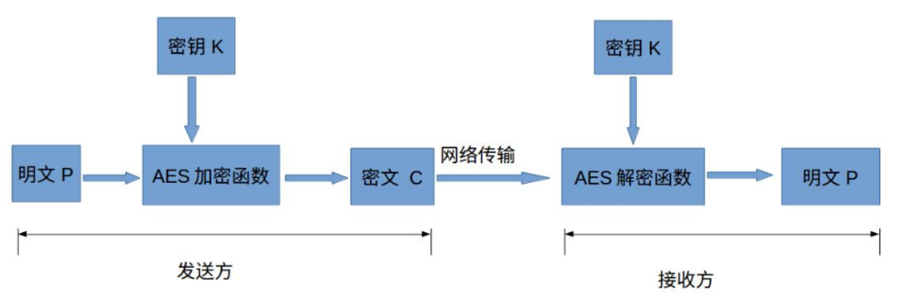
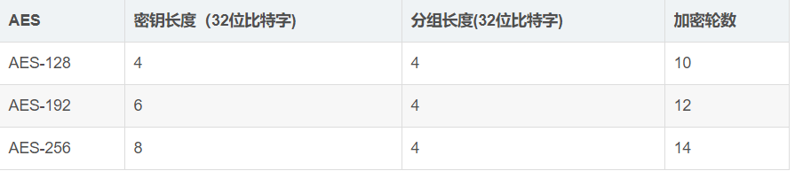
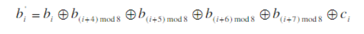
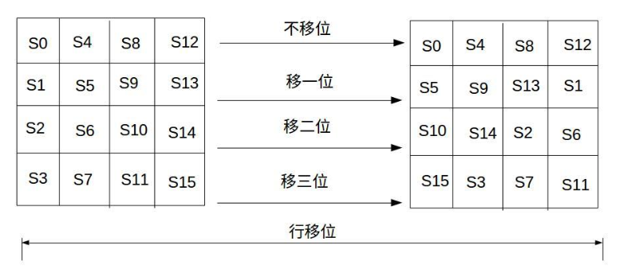
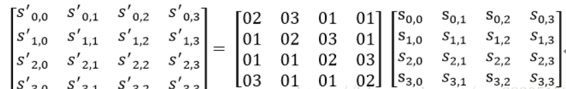
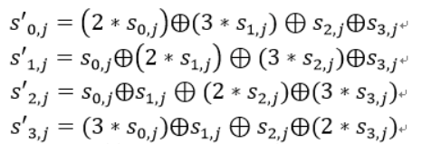
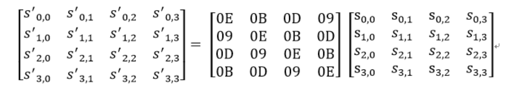
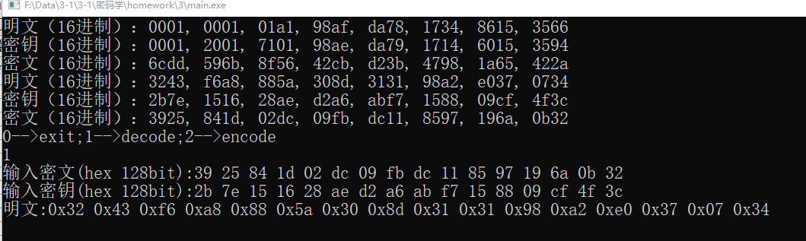
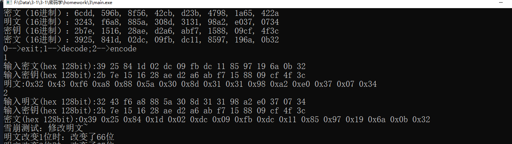
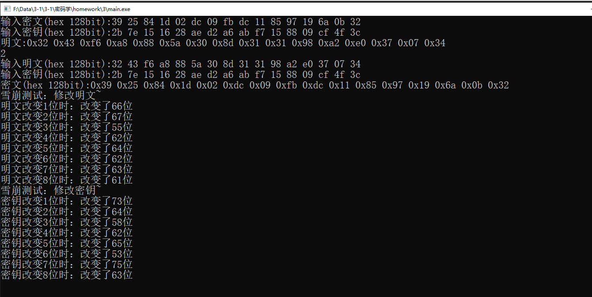

### 密码学实验报告——分组密码算法ARS

#### 赵梓杰 1811463 信息安全

（实验环境 win10 dev c++）

1. 实验目的

   通过AES算法的编程实验加深对AES算法运行原理的理解，以进一步理解分组密码的加密算法设计和解密算法设计

2. AES算法

   高级加密标准（AES）为最常见的对称加密算法，对称加密算法也就是加密和解密使用相同密钥，具体的加密流程如下图：

   

   明文P：没有经过加密的数据。

   密钥K：用来加密明文的密码，在对称加密算法中，加密与解密的密钥是相同的。密钥为接收方与发送方协商产生，但不可以直接在网络上传输，否则会导致密钥泄漏。

   AES加密函数：设AES加密函数为E，则 C = E(K, P),其中P为明文，K为密钥，C为密文。也就是说，把明文P和密钥K作为加密函数的参数输入，则加密函数E会输出密文C。

   密文C：经加密函数处理后的数据。

   AES解密函数：设AES解密函数为D，则 P = D(K, C),其中C为密文，K为密钥，P为明文。也就是说，把密文C和密钥K作为解密函数的参数输入，则解密函数会输出明文P。

   - **AES加密**

   AES为分组密码，分组密码也就是将明文分成一组一组的，每组长度相等，每次加密一组数据，直到加密完整个明文。在AES标准规范中，分组长度只能是128位，也就是说，每个分组为16个字节（每个字节8位）。密钥的长度可以使用128位、192位或256位。密钥的长度不同，推荐加密轮数也不同。

   

   AES的加密公式为C = E(K,P)，在加密函数E中，会执行一个轮函数，并且执行10次这个轮函数，这个轮函数的前9次执行的操作是一样的，只有第10次有所不同。也就是说，一个明文分组会被加密10轮。AES的核心就是实现一轮中的所有操作。

   - **字节代换**

   AES的字节代换其实就是一个简单的查表操作。AES定义了一个S盒和一个逆S盒，如何生成S盒和逆S盒成了一个难点。

   生成S盒的过程大致分为两个步骤：

   1. 按字节升序逐行初始化S盒，将每个字节映射为它在有限域GF(2^8)上的逆，其中{00}被映射为它自身{00}。

   2. 对S盒中的每个字节进行如下变换：

      

      其中0<=i<8，bi是字节的第i比特，ci是值为{63}或{01100011}的字节c的第i比特

   状态矩阵中的元素按照下面的方式映射为一个新的字节：把该字节的高4位作为行值，低4位作为列值，取出S盒或者逆S盒中对应的行的元素作为输出。例如，加密时，输出的字节S1为0x12,则查S盒的第0x01行和0x02列，得到值0xc9,然后替换S1原有的0x12为0xc9。

   - 行移位

   行移位是一个简单的左循环移位操作。当密钥长度为128比特时，状态矩阵的第0行左移0字节，第1行左移1字节，第2行左移2字节，第3行左移3字节

   

   行移位的逆变换是将状态矩阵中的每一行执行相反的移位操作，例如AES-128中，状态矩阵的第0行右移0字节，第1行右移1字节，第2行右移2字节，第3行右移3字节。

   - 列混合

   列混合变换是通过矩阵的相乘来实现的，经行移位后的状态矩阵与固定的矩阵相乘，得到混淆后的状态矩阵

   

   状态矩阵中的第j列(0≤j≤3)的列混合可以表示为下图所示

   

   列混合逆运算：

   

   最后还应该将密文结果从矩阵形式还原成字符串形式

   - 轮密钥加

   加密过程中，每轮的输入与轮密钥异或一次（当前分组和扩展密钥的一部分进行按位异或）；因为二进制数连续异或一个数结果是不变的，所以在解密时再异或上该轮的密钥即可恢复输入。首尾使用轮密钥加的理由：若将其他不需要密钥的阶段放在首尾，在不用密钥的情况下就能完成逆过程，这就降低了算法的安全性。

   加密原理：轮密钥加本身不难被破解，另外三个阶段分别提供了混淆和非线性功能。可是字节替换、行移位、列混淆阶段没有涉及密钥，就它们自身而言，并没有提供算法的安全性。但该算法经历一个分组的异或加密（轮密钥加），再对该分组混淆扩散（其他三个阶段），再接着又是异或加密，如此交替进行，这种方式非常有效非常安全。

   - 密钥拓展

   密钥拓展的复杂性是保证该算法安全性的重要部分，AES的密钥扩展的目的是将输入的128位密钥扩展成11个128位的子密钥。AES的密钥扩展算法是以字为一个基本单位（一个字为4个字节），刚好是密钥矩阵的一列。因此4个字（128位）密钥需要扩展成11个子密钥，共44个字。

   密钥拓展过程主要为：将初始密钥以列为主，转化为4个32 bits的字，分别记为w[0…3]；按照如下方式，依次求解w[i]，其中i是整数并且属于[4,43]。

   1. 将w[i]循环左移一个字节
   2. 分别对每个字节按S盒进行映射。
   3. 32 bits的常量（RC[i/4],0,0,0）进行异或，RC是一个一维数组，其中RC = {01, 02, 04, 08, 10, 20, 40, 80, 1B, 36}。
   4. 除了轮密钥的第一列使用上述方法，之后的二到四列都是w[i]=w[i-4]⊕w[i-1]
   5. 最终得到的第一个扩展密钥为（之后的每一轮密钥都是在前一轮的基础上按照上述方法得到的）

3. AES解密

   

4. AES加密

   

5. 雪崩效应（为了方便选择修改前8位）

   

   根据结果手动计算，明文修改大概为62.5位，密钥修改大概为64.125位

6. 程序代码

   ```cpp
   //myaes.h
   #include<iostream>
   #include<string>
   //S盒 
   int S[16][16] = {
   	0x63, 0x7c, 0x77, 0x7b, 0xf2, 0x6b, 0x6f, 0xc5, 0x30, 0x01, 0x67, 0x2b, 0xfe, 0xd7, 0xab, 0x76,
   	0xca, 0x82, 0xc9, 0x7d, 0xfa, 0x59, 0x47, 0xf0, 0xad, 0xd4, 0xa2, 0xaf, 0x9c, 0xa4, 0x72, 0xc0,
   	0xb7, 0xfd, 0x93, 0x26, 0x36, 0x3f, 0xf7, 0xcc, 0x34, 0xa5, 0xe5, 0xf1, 0x71, 0xd8, 0x31, 0x15,
   	0x04, 0xc7, 0x23, 0xc3, 0x18, 0x96, 0x05, 0x9a, 0x07, 0x12, 0x80, 0xe2, 0xeb, 0x27, 0xb2, 0x75,
   	0x09, 0x83, 0x2c, 0x1a, 0x1b, 0x6e, 0x5a, 0xa0, 0x52, 0x3b, 0xd6, 0xb3, 0x29, 0xe3, 0x2f, 0x84,
   	0x53, 0xd1, 0x00, 0xed, 0x20, 0xfc, 0xb1, 0x5b, 0x6a, 0xcb, 0xbe, 0x39, 0x4a, 0x4c, 0x58, 0xcf,
   	0xd0, 0xef, 0xaa, 0xfb, 0x43, 0x4d, 0x33, 0x85, 0x45, 0xf9, 0x02, 0x7f, 0x50, 0x3c, 0x9f, 0xa8,
   	0x51, 0xa3, 0x40, 0x8f, 0x92, 0x9d, 0x38, 0xf5, 0xbc, 0xb6, 0xda, 0x21, 0x10, 0xff, 0xf3, 0xd2,
   	0xcd, 0x0c, 0x13, 0xec, 0x5f, 0x97, 0x44, 0x17, 0xc4, 0xa7, 0x7e, 0x3d, 0x64, 0x5d, 0x19, 0x73,
   	0x60, 0x81, 0x4f, 0xdc, 0x22, 0x2a, 0x90, 0x88, 0x46, 0xee, 0xb8, 0x14, 0xde, 0x5e, 0x0b, 0xdb,
   	0xe0, 0x32, 0x3a, 0x0a, 0x49, 0x06, 0x24, 0x5c, 0xc2, 0xd3, 0xac, 0x62, 0x91, 0x95, 0xe4, 0x79,
   	0xe7, 0xc8, 0x37, 0x6d, 0x8d, 0xd5, 0x4e, 0xa9, 0x6c, 0x56, 0xf4, 0xea, 0x65, 0x7a, 0xae, 0x08,
   	0xba, 0x78, 0x25, 0x2e, 0x1c, 0xa6, 0xb4, 0xc6, 0xe8, 0xdd, 0x74, 0x1f, 0x4b, 0xbd, 0x8b, 0x8a,
   	0x70, 0x3e, 0xb5, 0x66, 0x48, 0x03, 0xf6, 0x0e, 0x61, 0x35, 0x57, 0xb9, 0x86, 0xc1, 0x1d, 0x9e,
   	0xe1, 0xf8, 0x98, 0x11, 0x69, 0xd9, 0x8e, 0x94, 0x9b, 0x1e, 0x87, 0xe9, 0xce, 0x55, 0x28, 0xdf,
   	0x8c, 0xa1, 0x89, 0x0d, 0xbf, 0xe6, 0x42, 0x68, 0x41, 0x99, 0x2d, 0x0f, 0xb0, 0x54, 0xbb, 0x16
   };
   //与S盒对应的逆置换表 
   int rS[16][16] = {
   	0x52, 0x09, 0x6a, 0xd5, 0x30, 0x36, 0xa5, 0x38, 0xbf, 0x40, 0xa3, 0x9e, 0x81, 0xf3, 0xd7, 0xfb,
   	0x7c, 0xe3, 0x39, 0x82, 0x9b, 0x2f, 0xff, 0x87, 0x34, 0x8e, 0x43, 0x44, 0xc4, 0xde, 0xe9, 0xcb,
   	0x54, 0x7b, 0x94, 0x32, 0xa6, 0xc2, 0x23, 0x3d, 0xee, 0x4c, 0x95, 0x0b, 0x42, 0xfa, 0xc3, 0x4e,
   	0x08, 0x2e, 0xa1, 0x66, 0x28, 0xd9, 0x24, 0xb2, 0x76, 0x5b, 0xa2, 0x49, 0x6d, 0x8b, 0xd1, 0x25,
   	0x72, 0xf8, 0xf6, 0x64, 0x86, 0x68, 0x98, 0x16, 0xd4, 0xa4, 0x5c, 0xcc, 0x5d, 0x65, 0xb6, 0x92,
   	0x6c, 0x70, 0x48, 0x50, 0xfd, 0xed, 0xb9, 0xda, 0x5e, 0x15, 0x46, 0x57, 0xa7, 0x8d, 0x9d, 0x84,
   	0x90, 0xd8, 0xab, 0x00, 0x8c, 0xbc, 0xd3, 0x0a, 0xf7, 0xe4, 0x58, 0x05, 0xb8, 0xb3, 0x45, 0x06,
   	0xd0, 0x2c, 0x1e, 0x8f, 0xca, 0x3f, 0x0f, 0x02, 0xc1, 0xaf, 0xbd, 0x03, 0x01, 0x13, 0x8a, 0x6b,
   	0x3a, 0x91, 0x11, 0x41, 0x4f, 0x67, 0xdc, 0xea, 0x97, 0xf2, 0xcf, 0xce, 0xf0, 0xb4, 0xe6, 0x73,
   	0x96, 0xac, 0x74, 0x22, 0xe7, 0xad, 0x35, 0x85, 0xe2, 0xf9, 0x37, 0xe8, 0x1c, 0x75, 0xdf, 0x6e,
   	0x47, 0xf1, 0x1a, 0x71, 0x1d, 0x29, 0xc5, 0x89, 0x6f, 0xb7, 0x62, 0x0e, 0xaa, 0x18, 0xbe, 0x1b,
   	0xfc, 0x56, 0x3e, 0x4b, 0xc6, 0xd2, 0x79, 0x20, 0x9a, 0xdb, 0xc0, 0xfe, 0x78, 0xcd, 0x5a, 0xf4,
   	0x1f, 0xdd, 0xa8, 0x33, 0x88, 0x07, 0xc7, 0x31, 0xb1, 0x12, 0x10, 0x59, 0x27, 0x80, 0xec, 0x5f,
   	0x60, 0x51, 0x7f, 0xa9, 0x19, 0xb5, 0x4a, 0x0d, 0x2d, 0xe5, 0x7a, 0x9f, 0x93, 0xc9, 0x9c, 0xef,
   	0xa0, 0xe0, 0x3b, 0x4d, 0xae, 0x2a, 0xf5, 0xb0, 0xc8, 0xeb, 0xbb, 0x3c, 0x83, 0x53, 0x99, 0x61,
   	0x17, 0x2b, 0x04, 0x7e, 0xba, 0x77, 0xd6, 0x26, 0xe1, 0x69, 0x14, 0x63, 0x55, 0x21, 0x0c, 0x7d
   };
   int rC[10] = {
   	0x01,0x02,0x04,0x08,0x10,0x20,0x40,0x80,0x1b,0x36
   };
   ```

   ```c++
   //main.cpp
   #include "myaes.h"
   using namespace std;
   string int2binstr(int text[4][4]){
   	string result;
   	for(int i = 0;i<4;i++){
   		for(int j = 0;j<4;j++){
   			string str = "00000000";
   			int temp = text[j][i];
   			for(int k = 7;k>=0;k--) {
   				str[k] = '0' + temp % 2;
   				temp /= 2;
   			}
   			result += str;
   		}
   	}
   	return result;
   } 
   void binstr2int(int text[4][4],string str){
   	unsigned char* output = new unsigned char[16];
   	for(int i = 0;i <= 15;i++){
   		int start = i*8;
   		int temp = 0;
   		for(int j = start;j<=start + 7;j++){
   			int each = 1;
   			for(int s = 1;s <= 7 - j + start;s++){
   				each *= 2;
   			}
   			if(str[i] == '1'){
   				temp += each;	
   			}
   		}
   		output[i] = temp;
   	}
   	for(int i = 0;i<4;i++){
   		for(int j = 0;j<4;j++){
   			text[j][i] = output[j*4+i];
   		}
   	}
   }
   //基本运算
   int mult(int a, int b)
   {
   	int third = b & 0x8;
   	int second = b & 0x4;
   	int first = b & 0x2;
   	int firstMod = b % 2;
   	int res = 0;
   
   	if (third)
   	{
   		int temp = a;
   		for (int i = 1; i <= 3; ++i)
   		{
   			temp = temp << 1;
   			if (temp >= 256)
   			{
   				temp = temp ^ 0x11b;
   			}
   		}
   		temp = temp % 256;
   		res = res ^ temp;
   	}
   	if (second)
   	{
   		int temp = a;
   		for (int i = 1; i <= 2; ++i)
   		{
   			temp = temp << 1;
   			if (temp >= 256)
   			{
   				temp = temp ^ 0x11b;
   			}
   		}
   		temp = temp % 256;
   		res = res ^ temp;
   	}
   	if (first)
   	{
   		int temp = a;
   		temp = temp << 1;
   		if (temp >= 256)
   		{
   			temp = temp ^ 0x11b;
   		}
   		temp = temp % 256;
   		res = res ^ temp;
   	}
   	if (firstMod)
   	{
   		res = res ^ a;
   	}
   	return res;
   }
   void KeyExpansion(int key[4][4], int w[11][4][4])
   {
   	for (int i = 0; i < 4; ++i)
   	{
   		for (int j = 0; j < 4; j++)
   		{
   			w[0][i][j] = key[j][i];
   
   		}
   	}
   	for (int i = 1; i < 11; ++i)
   	{
   		for (int j = 0; j < 4; ++j)
   		{
   			int temp[4];
   			if (j == 0)
   			{
   				temp[0] = w[i - 1][3][1];
   				temp[1] = w[i - 1][3][2];
   				temp[2] = w[i - 1][3][3];
   				temp[3] = w[i - 1][3][0];
   				for (int k = 0; k < 4; ++k)
   				{
   					int m = temp[k];
   					int row = m / 16;
   					int col = m % 16;
   					temp[k] = S[row][col];
   					if (k == 0)
   					{
   						temp[k] = temp[k] ^ rC[i - 1];
   					}
   				}
   			}
   			else
   			{
   				temp[0] = w[i][j - 1][0];
   				temp[1] = w[i][j - 1][1];
   				temp[2] = w[i][j - 1][2];
   				temp[3] = w[i][j - 1][3];
   			}
   			for (int x = 0; x < 4; x++)
   			{
   				w[i][j][x] = w[i - 1][j][x] ^ temp[x];
   			}
   		}
   	}
   }
   void ByteSub(int in[4][4], int type)
   {
   	for (int i = 0; i < 4; i++)
   	{
   		for (int j = 0; j < 4; j++)
   		{
   			int temp = in[i][j];
   			int row = temp / 16;
   			int col = temp % 16;
   			if (type == 1)
   			{
   				in[i][j] = S[row][col];
   			}
   			if (type == 0)
   			{
   				in[i][j] = rS[row][col];
   			}
   		}
   	}
   }
   void ShiftRow(int in[4][4], int type) {
   	for (int i = 0; i < 4; i++)
   	{
   		for (int j = 0; j < i; j++)
   		{
   			if (type == 1)
   			{
   				int temp = in[i][0];
   				in[i][0] = in[i][1];
   				in[i][1] = in[i][2];
   				in[i][2] = in[i][3];
   				in[i][3] = temp;
   			}
   			else
   			{
   				int temp = in[i][3];
   				in[i][3] = in[i][2];
   				in[i][2] = in[i][1];
   				in[i][1] = in[i][0];
   				in[i][0] = temp;
   			}
   		}
   	}
   }
   void MixColumn(int in[4][4], int type)
   {
   	for (int i = 0; i < 4; i++)
   	{
   		int t0 = in[0][i];
   		int t1 = in[1][i];
   		int t2 = in[2][i];
   
   		int t3 = in[3][i];
   		if (type == 1)
   		{
   			in[0][i] = mult(t0, 2) ^ mult(t1, 3) ^ t2 ^ t3;
   			in[1][i] = t0 ^ mult(t1, 2) ^ mult(t2, 3) ^ t3;
   			in[2][i] = t0 ^ t1 ^ mult(t2, 2) ^ mult(t3, 3);
   			in[3][i] = mult(t0, 3) ^ t1 ^ t2 ^ mult(t3, 2);
   		}
   		else
   		{
   			in[0][i] = mult(t0, 14) ^ mult(t1, 11) ^ mult(t2, 13) ^ mult(t3, 9);
   			in[1][i] = mult(t0, 9) ^ mult(t1, 14) ^ mult(t2, 11) ^ mult(t3, 13);
   			in[2][i] = mult(t0, 13) ^ mult(t1, 9) ^ mult(t2, 14) ^ mult(t3, 11);
   			in[3][i] = mult(t0, 11) ^ mult(t1, 13) ^ mult(t2, 9) ^ mult(t3, 14);
   		}
   	}
   }
   void AddRoundKey(int in[4][4], int key[4][4])
   {
   	for (int i = 0; i < 4; ++i)
   	{
   		for (int j = 0; j < 4; j++)
   		{
   			in[i][j] = in[i][j] ^ key[j][i];
   		}
   	}
   }
   
   //实现
   void Encode(int in[4][4], int key[4][4])
   {
   	int type = 1;
   	int subKey[11][4][4];
   	KeyExpansion(key, subKey);
   	AddRoundKey(in, subKey[0]);
   	for (int i = 1; i <= 10; ++i)
   	{
   		ByteSub(in, type);
   		ShiftRow(in, type);
   		if (i != 10)
   		{
   			MixColumn(in, type);
   		}
   		AddRoundKey(in, subKey[i]);
   	}
   }
   void Decode(int in[4][4], int key[4][4])
   {
   	int type = 0;
   	int subKey[11][4][4];
   	KeyExpansion(key, subKey);
   	AddRoundKey(in, subKey[10]);
   	for (int i = 9; i >= 0; --i)
   	{
   		ShiftRow(in, type);
   		ByteSub(in, type);
   		AddRoundKey(in, subKey[i]);
   		if (i != 0)
   		{
   			MixColumn(in, type);
   		}
   
   	}
   }
   
   int main(){	
   	cout<<"明文（16进制）：0001, 0001, 01a1, 98af, da78, 1734, 8615, 3566"<<endl<<"密钥（16进制）：0001, 2001, 7101, 98ae, da79, 1714, 6015, 3594"<<endl<<"密文（16进制）：6cdd, 596b, 8f56, 42cb, d23b, 4798, 1a65, 422a"<<endl;
   	cout<<"明文（16进制）：3243, f6a8, 885a, 308d, 3131, 98a2, e037, 0734"<<endl<<"密钥（16进制）：2b7e, 1516, 28ae, d2a6, abf7, 1588, 09cf, 4f3c"<<endl<<"密文（16进制）：3925, 841d, 02dc, 09fb, dc11, 8597, 196a, 0b32"<<endl;
   	int flag;
   	cout<<"0-->exit;1-->decode;2-->encode"<<endl;
   	while(1){
   		cin>>flag;
   		if(flag == 0){
   			break;
   		}
   		switch (flag){
   		case 1:
   		{
   			int text[4][4];
   			int key[4][4];
   			cout<<"输入密文(hex 128bit):";
   			for (int i = 0; i < 4; i++)
   			{
   				for (int j = 0; j < 4; j++)
   				{
   					cin >> (hex) >> text[j][i];
   				}
   			}
   			cout<<"输入密钥(hex 128bit):";
   			for (int i = 0; i < 4; i++)
   			{
   				for (int j = 0; j < 4; j++)
   				{
   					cin >> (hex) >> key[j][i];
   				}
   			}
   			Decode(text, key);
   			cout << "明文:";
   			for (int i = 0; i < 4; i++)
   			{
   				for (int j = 0; j < 4; j++)
   				{
   					cout << "0x";
   					if (text[j][i] < 16)
   						cout << "0";
   					cout << (hex) << text[j][i] << " ";
   				}
   			}
   			cout<<endl;
   			break;
   		}
   		case 2:
   		{
   			int text[4][4];
   			int text_new[4][4];
   			int text_old[4][4];
   			int key[4][4];
   			int key_new[4][4];
   			cout << "输入明文(hex 128bit):";
   			for (int i = 0; i < 4; i++)
   			{
   				for (int j = 0; j < 4; j++)
   				{
   					cin >> (hex) >> text[j][i];
   					text_new[j][i] = text[j][i];
   					text_old[j][i] = text[j][i];
   				}
   			}
   			cout << "输入密钥(hex 128bit):";
   			for (int i = 0; i < 4; i++)
   			{
   				for (int j = 0; j < 4; j++)
   				{
   					cin >> (hex) >> key[j][i];
   					key_new[j][i] = key[j][i];
   				}
   			}
   			Encode(text, key);
   			cout << "密文(hex 128bit):";
   			for (int i = 0; i < 4; i++)
   			{
   				for (int j = 0; j < 4; j++)
   				{
   					cout << "0x";
   					if (text[j][i] < 16)
   						cout << "0";
   					cout << (hex) << text[j][i] << " ";
   				}
   
   			}
   			cout<<endl;
   			//修改前8位 
   			cout<<"雪崩测试：修改明文~"<<endl;
   			string result = int2binstr(text_new);
   			for(int i = 0;i <= 7;i++){
   				cout<<"明文改变"<<(i+1)<<"位时：";
   				if(result[i] == '0')
   					result[i] = '1';
   				else
   					result[i] = '0';
   				binstr2int(text_new,result);
   				Encode(text_new,key);
   				int result_text = 0;
   				string s_new = int2binstr(text_new);
   				string s = int2binstr(text);
   				for(int i = 0;i<128;i++){
   					if(s_new[i] == s[i]){
   						result_text++;
   					}
   				}
   				cout<<"改变了";
   				cout<<(dec)<<result_text<<"位"<<endl;
   			}
   			cout<<"雪崩测试：修改密钥~"<<endl;
   			result = int2binstr(key_new);
   			for(int i = 0;i <= 7;i++){
   				cout<<"密钥改变"<<(i+1)<<"位时：";
   				if(result[i] == '0')
   					result[i] = '1';
   				else
   					result[i] = '0';
   				binstr2int(key_new,result);
   				Encode(text_old,key_new);
   				int result_text = 0;
   				string s_new = int2binstr(text_old);
   				string s = int2binstr(text);
   				for(int i = 0;i<128;i++){
   					if(s_new[i] == s[i]){
   						result_text++;
   					}
   				}
   				cout<<"改变了";
   				cout<<(dec)<<result_text<<"位"<<endl;
   			}
   			break;
   		}
   		default:
   		{
   			cout<<"0-->exit;1-->decode;2-->encode"<<endl;
   			break;
   		}
   		}
   	}
   	system("pause");
   	return 0;
   }
   ```

   

