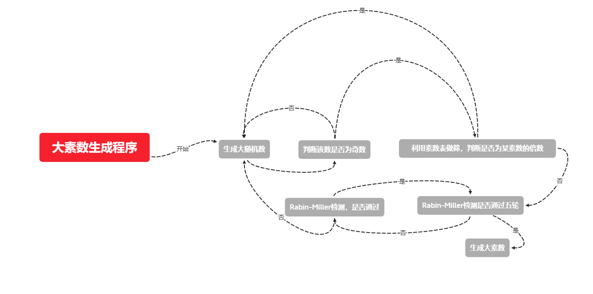
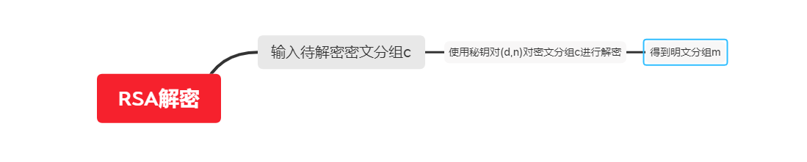
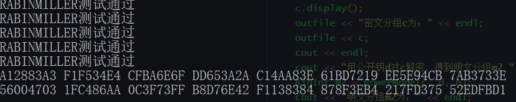
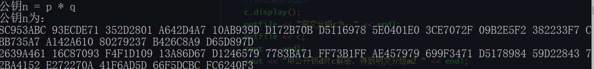
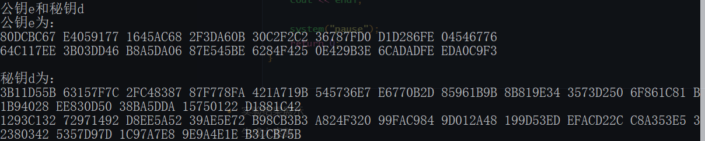
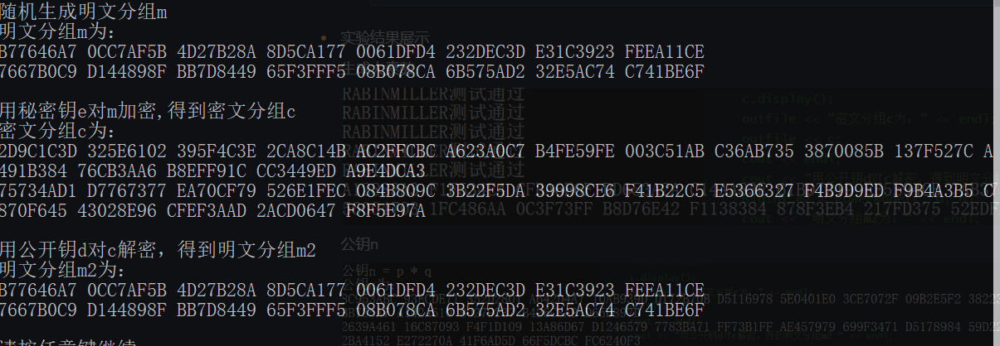

### 密码学实验报告——密码算法RSA

#### 赵梓杰 1811463 信息安全

- 基本内容

  RSA算法简答而言就是将一个很大的整数M，艰难地分解成两个质数a和b，并且a*b=M，RSA是非对称加密，需要两个密钥，一个是公开密钥，另外一个是私有密钥，一个用作于加密的时候，另一个则用于解密

  - 公钥和私钥的产生过程

    - 选择两个不相等的质数p,q
    - 计算p,q的乘积n
    - 计算n的欧拉函数φ(n)=(p-1)*(q-1),计算出来的值就是不大于n且与n互质的整数个数
    - 选择一个与φ(n)互质的整数e，且1<e<φ(n)
    - 计算e对于φ(n)的模反元素d，计算公式d*e≡1(mod(n))。
    - 公钥(n,e),私钥(n,d)。
    - 销毁p，q

  - 加解密过程

    - 加密

      - 发送方向接收方发送明文信息m，发送方使用公钥(n,e)依照如下公式加密：
        m^e=c(mod n)
        m必须是整数，且小于n。根据上面的公式可以算出密文C

    - 解密

      - 接收方获取密文c，使用自己的私钥(n,d)依照如下公式解密
        $$
        c^d=mmod n
        $$
        c,d,n已知，可以算出明文m

  如果p和q都销毁了，很难通过公钥获得私钥，反之亦然

- RSA所依赖的数学难题

  主要是对于极大整数做质因数分解的高难度

- 实验要求

  1. 为了加深对RSA算法的了解，根据已知参数：p＝3，q＝11，m＝2，

  手工计算公钥和私钥，并对明文m进行加密，然后对密文进行解密。

  2. 编写一个程序，用于生成512比特的素数。

  3. 利用2中程序生成的素数，构建一个n的长度为1024比特的RSA算法，

  利用该算法实现对明文的加密和解密。

  4. 在附件中还给出了一个可以进行RSA加密和解密的对话框程序RSATool，运行这个程序加密一段文字，了解RSA算法原理。

- 实验内容

  - 大素数生成程序流程图

    

  - RSA加密流程图

    

  - RSA解密流程图

    

  - 大素数生成部分代码

    ```c++
    //产生一个待测素数,保证此数为奇数,且不能被小于5000的素数整除
    void SortPrime(BigInt& n)
    {
    	int i = 0;
    	BigInt divisor;
    	const int length = sizeof(prime) / sizeof(int);
    
    	while (i != length)
    	{
    		n.Random();
    		while (!n.IsOdd())
    			n.Random();
    
    		i = 0;
    		for (; i < length; i++)
    		{
    			divisor = prime[i];
    			if ((n % divisor) == 0)
    				break;
    		}
    	}
    }
    //对大奇数n进行RabinMiller检测
    bool RabinMiller(const BigInt& n)
    {
    	BigInt r, a, y;
    	unsigned int s, j;
    	r = n - 1;
    	s = 0;
    
    	while (!r.IsOdd())
    	{
    		s++;
    		r >> 1;
    	}
    
    	//随机产生一个小于N-1的检测数a
    	a.Randomsmall();
    
    	//y = a的r次幂模n
    	y = PowerMode(a, r, n);
    
    	//检测J=2至J<S轮
    	if ((!(y == 1)) && (!(y == (n - 1))))
    	{
    		j = 1;
    		while ((j <= s - 1) && (!(y == (n - 1))))
    		{
    			y = (y * y) % n;
    			if (y == 1)
    				return false;
    			j++;
    		}
    		if (!(y == (n - 1)))
    			return false;
    	}
    	return true;
    }
    
    //产生一个素数
    BigInt GeneratePrime()
    {
    	BigInt n;
    	int i = 0;
    
    	//无限次循环，不断产生素数，直到i==5时（通过五轮RabinMiller测试）才会跳出while循环
    	while (i < 5)
    	{
    		cout << "产生待测大奇数：" << endl;
    		SortPrime(n);
    		n.display();
    
    		i = 0;
    		//进行五轮RABINMILLER测试,五轮全部通过则素数合格
    		for (; i < 5; i++)
    		{
    			if (!RabinMiller(n))
    			{
    				cout << "RABINMILLER测试失败" << endl;
    				break;
    			}
    			cout << "RABINMILLER测试通过" << endl;
    		}
    	}
    	return n;
    }
    ```

  - RSA加密解密部分代码

    ```c++
    #include <iostream>
    #include <fstream>
    #include <stdlib.h>
    #include "bigint.h"
    #include "gen.h"
    #include <ctime>
    
    using namespace std;
    
    int main()
    {
    	ofstream outfile("test.txt");
    	cout << "开始生成大素数p" << endl;
    
    	//产生大素数
    	BigInt p = GeneratePrime();
    
    	//16进制形式显示
    	p.display();
    	outfile << "大素数p:" << endl;
    	outfile << p;
    	cout << endl;
    
    	cout << "开始生成素数q" << endl;
    
    	//产生大素数
    	BigInt q = GeneratePrime();
    
    	//16进制形式显示
    	q.display();
    	outfile << "大素数q:" << endl;
    	outfile << q;
    	cout << endl;
    	cout << "公钥n = p * q" << endl;
    	BigInt n = p * q;
    
    	cout << "公钥n为： " << endl;
    	//16进制形式显示
    	n.display();
    	outfile << "公钥n为：" << endl;
    	outfile << n;
    	cout << endl;
    	cout << "公钥e和秘钥d " << endl;
    	BigInt t = (p - 1) * (q - 1);
    
    	//e为公开钥
    	BigInt e;
    
    	//d为秘密钥，即e模t的乘法逆元
    	BigInt d;
    
    	//y用于参与扩展欧几里得运算，存储t模e的乘法逆元
    	BigInt y;
    
    	BigInt temp;
    
    	while (1)
    	{
    		//产生与t互质的e
    		e.Random();
    		while (!(Gcd(e, t) == 1))
    		{
    			e.Random();
    		}
    
    		//用扩展欧几里德算法试图求出e模t的乘法逆元
    		temp = ExtendedGcd(e, t, d, y);
    
    		//e*d模t结果为1，说明d确实是e模t的乘法逆元
    		temp = (e * d) % t;
    		if (temp == 1)
    			break;
    
    		//否则重新生成e
    	}
    
    
    	cout << "公钥e为： " << endl;
    	//16进制形式显示
    	e.display();
    	outfile << "公钥e:" << endl;
    	outfile << e;
    	cout << endl;
    
    	cout << "秘钥d为： " << endl;
    	//16进制形式显示
    	d.display();
    	outfile << "秘钥d:" << endl;
    	outfile << d;
    	cout << endl;
    	cout << "随机生成明文分组m " << endl;
    	BigInt m;
    	m.Random();
    	cout << "明文分组m为：" << endl;
    	//16进制形式显示
    	m.display();
    	outfile << "明文分组m为：" << endl;
    	outfile << m;
    	cout << endl;
    	cout << "用秘密钥e对m加密,得到密文分组c " << endl;
    	BigInt c = PowerMode(m, e, n);
    	cout << "密文分组c为：" << endl;
    	//16进制形式显示
    	c.display();
    	outfile << "密文分组c为：" << endl;
    	outfile << c;
    	cout << endl;
    	cout << "用公开钥d对c解密，得到明文分组m2 " << endl;
    	BigInt m2 = PowerMode(c, d, n);
    	cout << "明文分组m2为：" << endl;
    	//16进制形式显示
    	m2.display();
    	outfile << "明文分组m2为：" << endl;
    	outfile << m2;
    	cout << endl;
    
    	system("pause");
    	return 0;
    }
    
    ```

- 实验结果展示

  生成大素数

  

  公钥n

  

  

  公钥e和秘钥d

  

  加密解密

  