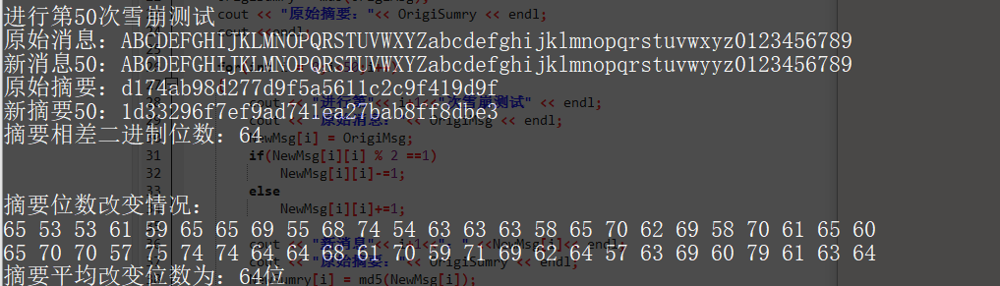

### 密码学实验报告——MD5

#### 赵梓杰 1811463 信息安全

- 实验目的

   通过实际编程了解MD5算法的过程，加深对Hash函数的认识

- 实验原理

  Hash函数是将任意长的数字串转换成一个较短的定长输出数字串的函数，输出的结果称为Hash值。Hash函数具有如下特点：

  （1） 快速性：对于任意一个输入值x，由Hash函数，计算Hash值y，即是非常容易的。

  （2） 单向性：对于任意一个输出值y，希望反向推出输入值x，使得，是非常困难的。

  （3） 无碰撞性：包括强无碰撞性和弱无碰撞性，一个好的Hash函数应该满足强无碰撞性，即找到两个不同的数字串x和y，满足，在计算上是不可能的。

  Hash函数可用于数字签名、消息的完整性检验。消息的来源认证检测等。

  现在常用的Hash算法有MD5、SHA－1等。下面从MD5入手来介绍Hash算法的实现机制。

    MD系列单向散列函数是由Ron Rivest设计的，MD5算法对任意长度的输入值处理后产生128位的Hash值。MD5算法的实现步骤如下（见图4－1）：

    在MD5算法中，首先需要对信息进行填充，使其字节长度与448模512同余，即信息的字节长度扩展至，n为一个正整数。填充的方法如下：在信息的后面填充第一位为1，其余各位均为0，直到满足上面的条件时才停止用0对信息的填充。然后，再在这个结果后面附加一个以64位二进制表示的填充前信息长度。经过这两步的处理，现在的信息字节长度为，即长度恰好是512的整数倍，这样做的目的是为了满足后面处理中对信息长度的要求。

     MD5中有A、B、C、D，4个32位被称为链接变量的整数参数，它们的

  初始值分别为：

    A0＝0x01234567，B0＝0x89abcdef,C0=0xfedcba98,D0=0x76543210

    当设置好这4个链接变量后，就开始进入算法的4轮循环运算。循环的次数是信息中512位信息分组数目。

    首先将上面4个链接变量复制到变量A、B、C、D中，以备后面进行处理。

    然后进入主循环，主循环有4轮，每轮循环都很相似。第一轮进行16次操作，每次操作对A、B、C、D中的3个做一次非线性函数运算，然后将所得结果加上第四个变量，文本的一个子分组（32位）和一个常数。再将所得结果向左循环移S位，并加上A、B、C、D其中之一。最后用该结果取代A、B、C、D其中之一。

     以下是每次操作中用到的4个非线性函数（每轮一个）。

  ​           

  ​           

  ​           

  ​           

     MD5轮主要操作为：

  ​           

     对应于四轮操作，f分别取F，G，H，I；对每一轮的16次运算，M分别取M1，M2，…，M16。对于4轮共64次运算，t为给定的一些常数，另外一个常数是的整数部分，其中i＝1，2，…，64。在中，i的单位是弧度，由此构成了32位的随机数源，它消除了输入数据中任何规律性的特征。

     对于4轮64次操作的具体运算，可查阅课本的内容。所有这些操作完成之后，将A，B，C，D分别加上A0，B0，C0，D0。然后用下一分组数据继续进行运算，最后得到一组A，B，C，D。把这组数据级联起来，即得到128比特的Hash结果。

  

- 实验内容

  - 程序流程图

    

  - 程序代码

    ```c++
    //md5 核心代码
    #include <iostream>
    #include <string>
    #include <cstring>
    #include <stdlib.h>
    using namespace std;
    
     //基本逻辑函数 宏定义
    #define F(b,c,d) (( b & c ) | (( ~b ) & ( d )))
    #define G(b,c,d) (( b & d ) | ( c & ( ~d )))
    #define H(b,c,d) ( b ^ c ^ d )
    #define I(b,c,d) ( c ^ ( b | ( ~d )))
    //x循环左移n位 宏定义
    #define shift(x,n) (( x << n ) | ( x >> ( 32 - n )))
    //压缩函数每轮的每步中A分块循环左移的位数
    const unsigned s[64] = 
    {
    	7, 12, 17, 22,  7, 12, 17, 22,  7, 12, 17, 22,  7, 12, 17, 22,
    	5,  9, 14, 20,  5,  9, 14, 20,  5,  9, 14, 20,  5,  9, 14, 20,
    	4, 11, 16, 23,  4, 11, 16, 23,  4, 11, 16, 23,  4, 11, 16, 23,
    	6, 10, 15, 21,  6, 10, 15, 21,  6, 10, 15, 21,  6, 10, 15, 21
    };
    const unsigned T[64] = 
    {
    	0xd76aa478, 0xe8c7b756, 0x242070db, 0xc1bdceee,
    	0xf57c0faf, 0x4787c62a, 0xa8304613, 0xfd469501,
    	0x698098d8, 0x8b44f7af, 0xffff5bb1, 0x895cd7be,
    	0x6b901122, 0xfd987193, 0xa679438e, 0x49b40821,
    	0xf61e2562, 0xc040b340, 0x265e5a51, 0xe9b6c7aa,
    	0xd62f105d, 0x02441453, 0xd8a1e681, 0xe7d3fbc8,
    	0x21e1cde6, 0xc33707d6, 0xf4d50d87, 0x455a14ed,
    	0xa9e3e905, 0xfcefa3f8, 0x676f02d9, 0x8d2a4c8a,
    	0xfffa3942, 0x8771f681, 0x6d9d6122, 0xfde5380c,
    	0xa4beea44, 0x4bdecfa9, 0xf6bb4b60, 0xbebfbc70,
    	0x289b7ec6, 0xeaa127fa, 0xd4ef3085, 0x04881d05,
    	0xd9d4d039, 0xe6db99e5, 0x1fa27cf8, 0xc4ac5665,
    	0xf4292244, 0x432aff97, 0xab9423a7, 0xfc93a039,
    	0x655b59c3, 0x8f0ccc92, 0xffeff47d, 0x85845dd1,
    	0x6fa87e4f, 0xfe2ce6e0, 0xa3014314, 0x4e0811a1,
    	0xf7537e82, 0xbd3af235, 0x2ad7d2bb, 0xeb86d391
    };
    string int2hexstr(int origin)
    {
    	const char str16[] = "0123456789abcdef";
    	unsigned hexNum;
    
    	string temp;
    	string hexString = "";
    
    	for (int i = 0; i < 4; i++) 
    	{
    		temp = "";
    		hexNum = (origin >> (i * 8)) & 0xff;
    		
    		for (int j = 0; j < 2; j++) 
    		{
    			temp.insert(0, 1, str16[hexNum % 16]);
    			hexNum /= 16;
    		}
    
    		hexString += temp;
    	}
    	return hexString;
    }
    string md5(string message)
    {
    	unsigned int A = 0x67452301;
    	unsigned int B = 0xefcdab89;
    	unsigned int C = 0x98badcfe;
    	unsigned int D = 0x10325476;
    	
    	int lengthInByte = message.length();
    	int groupNum = ((lengthInByte + 8) / 64) + 1;
    	unsigned int *messageByte = new unsigned int[groupNum * 16];
    	memset(messageByte, 0, sizeof(unsigned int)*groupNum * 16);
    	for (int i = 0; i < lengthInByte; i++) 
    	{
    		messageByte[i / 4] |= message[i] << ((i % 4) * 8);
    	}
    	messageByte[lengthInByte >> 2] |= 0x80 << ((lengthInByte % 4) * 8);
    	
    	messageByte[groupNum * 16 - 2] = lengthInByte * 8;
    
    	unsigned int a, b, c, d;
    	for (int i = 0; i < groupNum; i++) 
    	{
    		a = A; 
    		b = B; 
    		c = C; 
    		d = D;
    		unsigned int g;
    		int k;
    
    		for (int j = 0; j < 64; j++) 
    		{
    			if ( j < 16 )  
    			{
    				g = F(b, c, d);
    				k = j;
    			}
    			else if ( j>=16 && j < 32 ) 
    			{
    				g = G(b, c, d);
    				k = (1 + 5 * j) % 16;
    			}
    			else if ( j>=32 && j < 48 ) 
    			{
    				g = H(b, c, d);
    				k = (5 + 3 * j) % 16;
    			}
    			else if ( j>=48 && j < 64 )
    			{
    				g = I(b, c, d);
    				k = (7 * j) % 16;
    			}
    
    			unsigned tempd = d;
    			d = c;
    			c = b;
    			b = b + shift(a + g + messageByte[i * 16 + k] + T[j], s[j]);
    			a = tempd;
    		}
    		A = a + A;
    		B = b + B;
    		C = c + C;
    		D = d + D;
    	}
    	return int2hexstr(A) + int2hexstr(B) + int2hexstr(C) + int2hexstr(D);
    }
    int cmp_bit(string NewSumry,string OrigiSumry)
    {
    	int BitDiff = 0;
    	for(int part=0;part<8;part++)
    	{
    		string NewSumry_temp =NewSumry.substr(0+4*part, 4);
    		char * end_1;
    		long NewSumry_Int = static_cast<long>(strtol(NewSumry_temp.c_str(),&end_1,16));
    		string OrigiSumry_temp =OrigiSumry.substr(0+4*part, 4);
    		char * end_2;
    		long OrigiSumry_Int = static_cast<long>(strtol(OrigiSumry_temp.c_str(),&end_2,16));
    		for(int round = 0;round <16;round++ )
    		{
    			if( NewSumry_Int%2 != OrigiSumry_Int%2)
    			{
    				BitDiff++;
    			}
    			NewSumry_Int /= 2;
    			OrigiSumry_Int /= 2;
    		}
    	}
    
    	 return BitDiff;
    }
    ```

    ```c++
    //雪崩效应
    #include<iostream>
    #include<string>
    #include"md5.h"
    
    using namespace std;
    
    
    int main() 
    {
    	string OrigiMsg = "ABCDEFGHIJKLMNOPQRSTUVWXYZabcdefghijklmnopqrstuvwxyz0123456789";
    	string OrigiSumry;
    	string NewMsg [50];
    	string NewSumry [50];
    	int SumryBitChanged [50];
    	cout << "MD5 hash 算法" << endl;
    	cout << "请输入消息: ";
    	string Message = "";
    	cin >> Message;
    	cout << "128比特摘要H(Message)为：" <<endl;
    	cout << md5(Message) << endl; 
    	cout << "原始消息："<< OrigiMsg << endl;
    	OrigiSumry = md5(OrigiMsg);
    	cout << "原始摘要："<< OrigiSumry << endl;
    	cout <<endl;
    
    	for(int i = 0;i<50;i++)
    	{
    		cout << "进行第"<< i+1<<"次雪崩测试" << endl;
    		cout << "原始消息："<< OrigiMsg << endl;
    		NewMsg[i] = OrigiMsg;
    		if(NewMsg[i][i] % 2 ==1)
    			NewMsg[i][i]-=1;
    		else
    			NewMsg[i][i]+=1;
    
    		cout << "新消息"<< i+1<<"：" <<NewMsg[i]<< endl;
    		cout << "原始摘要："<< OrigiSumry << endl;
    		NewSumry[i] = md5(NewMsg[i]);
    		cout << "新摘要"<< i+1<<"：" <<NewSumry[i]<< endl;
    		SumryBitChanged[i] = cmp_bit(NewSumry[i],OrigiSumry);
    		cout << "摘要相差二进制位数："<< SumryBitChanged[i] << endl;
    		cout << endl << endl;
    	}
    	cout << "摘要位数改变情况："<<endl;
    	int ave=0;
    	for(int t = 0;t<50;t++)
    	{
    		ave += SumryBitChanged [t];
    		cout<<SumryBitChanged [t] <<" ";
    		if(t == 24)
    			cout<<endl;
    	}
    	cout<<endl;
    
    	ave /= 50;
    	cout << "摘要平均改变位数为："<< ave << "位"<<endl;
    
    	system("pause");
    	return 0;
    }
    ```

- 程序结果

  实验测试数据

  

  实验结果

  

  

  雪崩实验结果

  

  

  

